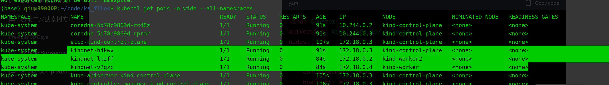
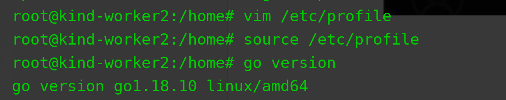
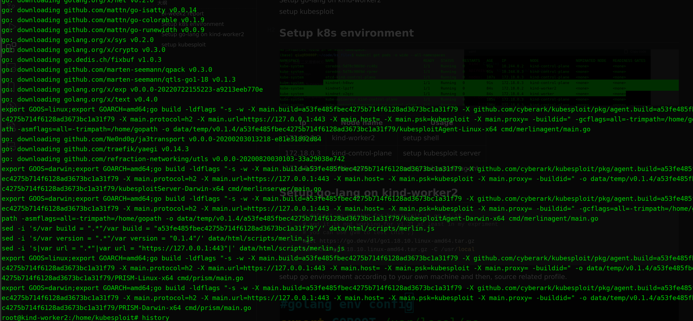
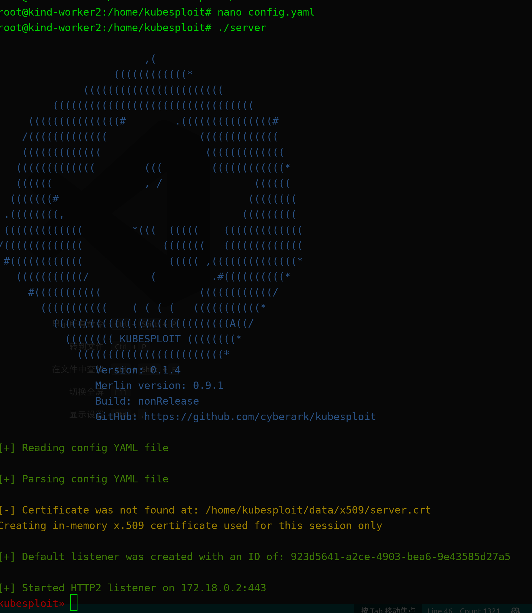
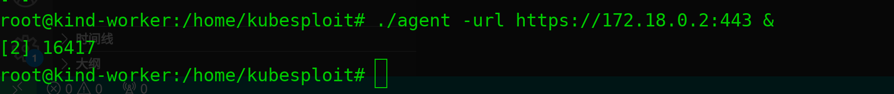
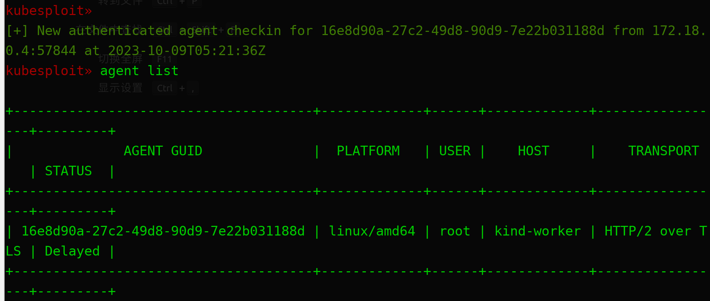
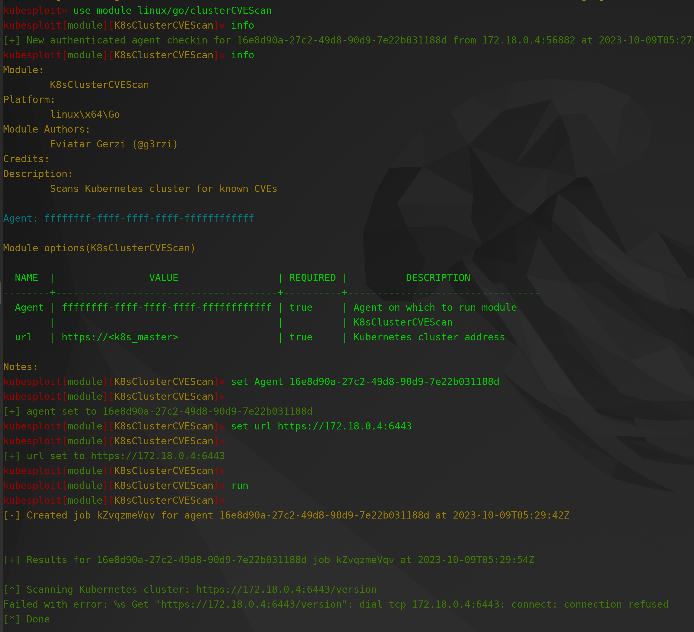

## bi-week2 report

| Name               | Time       |
| ------------------ | ---------- |
| Kaitao Qiu (Miles) | 10/08/2023 |

[toc]

## Setup k8s environment



| ip         | Node name          | Usage                   |
| ---------- | ------------------ | ----------------------- |
| 172.18.0.2 | kind-worker2       | setup kubesploit server |
| 172.18.0.3 | kind-control-plane |                         |
| 172.18.0.4 | kind-worker        | setup kubesploit agent  |

## Setup go-lang on kind-worker2

```bash
# defualt go version for kubesploit is go v1.18
# and it is not working for v1.21 at least in my expriment
# you can use gvm to test this ;)
wget https://go.dev/dl/go1.18.10.linux-amd64.tar.gz
tar -zxf go1.18.10.linux-amd64.tar.gz -C /usr/local

```

setup go environment according to your own machine and then, source related profile.




## setup kubesploit

```bash
git clone git@github.com:KaitaoQiu/kubesploit.git
cd kubesploit/
apt install build-essential
make
```



Doing the same thing on `kind-worker`

change the Interface on `config.yaml` in `kind-worker2`




And it shows that 

```bash
started HTTP2 listener on 172.18.0.2:443
```

Cheers!

Initially, you will find that there is no agent on kubesploit


after setup agent on `kind-worker`


you will find that

```bash
[+] New authenticated agent checkin for 16e8d90a-27c2-49d8-90d9-7e22b031188d from 172.18.0.4:57844 at 2023-10-09T05:21:36Z
```



## scan k8s cve


